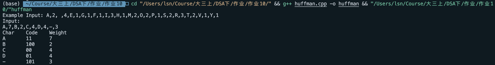
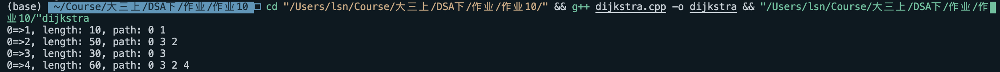

# 实验10 哈夫曼编码和迪杰斯特拉问题

姓名：邵宁录&nbsp&nbsp&nbsp&nbsp&nbsp&nbsp&nbsp&nbsp&nbsp&nbsp&nbsp学号：2018202195

## 目录
 1. [问题描述](#一问题描述)
 2. [算法基本思路](#二算法基本思路)
 3. [算法复杂度分析](#三算法复杂度分析)
 4. [源码](#四源码)
 5. [运行结果截图](#五运行结果截图)
 6. [问题与总结](#六问题与总结)

## 一、问题描述

### 哈夫曼编码

**输入**：字母,数字,字母,数字（如 A,7,B,2,C,4,D,4,-,3）

**输出**：哈夫曼编码的结果

### Dijkstra

**输入**：图的矩阵表示法，初始选择的点

**输出**：初始点到其他点的最短路径以及距离

## 二、算法基本思路

### 哈夫曼编码

哈夫曼编码采用贪心算法。算法思路非常简单清晰，每次从优先队列中取出频率最小的两个结点，合并成一个节点，并插回优先队列，直至队列中只有一个元素。

### Dijkstra

用Dijkstra算法寻找单源最短路径的策略仍然是贪心策略。其大概流程如下：

1. 有两个集合 $S$ 和 $V$ 。其中  $S$ 用于存放已经访问过的节点，$V$用于存放还未访问过的节点。将初始节点加入 $S$ 。
2. 将初始节点标为当前计算的节点，记为节点 $k$ ，然后开始计算 $k$ 到 $V$ 中各个点的距离，将其中最近的那个节点从 $V$ 中取出加入 $S$ 。
3. 将新加入的那个节点记为 $k$，重复第二步的计算操作。 

## 三、算法复杂度分析

### 哈夫曼编码

我们假定使用的最小优先队列是用堆实现的。

那么每次在取出两个节点，合并成一个节点并放回优先队列中时，会有一次堆的调整。在堆的实验中我们已经知道，其时间复杂度为 $\Omicron(\lg n)$ 。

又已知每次拿出两个节点，然后合并成一个节点放回，相当于每次只减小一个节点的规模。所以要遍历 $n$ 次。

综上，该过程的时间复杂度为 $\Omicron(n\lg n)$

### Dijkstra

假设总共有 $n$ 个点，那么要依次计算 $n-1,\ n-2\ ,\dots,\ 1$ 次距离。显然该算法的时间复杂度为 $\Omicron(n^2)$ 。

## 四、源码

### 哈夫曼编码

~~~c++
#include <iostream>
#include <string>
using namespace std;

#define INFINITE 2333333

//树结点定义
typedef struct 
{
    int weight;
    int parent;
    int lchild;
    int rchild;
} HTNode, *HuffmanTree;

//封装最小权节点和次小权节点
typedef struct 
{
    int node_1;
    int node_2;
} MinCode;

typedef string *HuffmanCode;

string Str;
//输出错误信息的函数
void Error(string message) {
    cerr << message << endl;
    exit(1);
}

MinCode FindTwoMin(HuffmanTree HT, int n) {
    //遍历找到最小与次小
    int min_1, min_2;
    int index_1, index_2;
    MinCode min;
    min_1 = INFINITE, min_2 = INFINITE;
    for(int i = 1; i <= n; i ++) {
        if(HT[i].parent == 0 && HT[i].weight < min_1) {
            min_1 = HT[i].weight;
            index_1 = i;
        }
    } 
    for(int i = 1; i <= n; i ++) {
        if(HT[i].parent == 0 && i != index_1 && HT[i].weight < min_2) {
            min_2 = HT[i].weight;
            index_2 = i;
        }
    }
    min.node_1 = index_1;
    min.node_2 = index_2;
    //cout << index_1 << "\t" << index_2 << endl;
    return min;
}

HuffmanCode HuffmanCoding(HuffmanTree &HT, HuffmanCode HC, int *w, int n) {
    //输入少于一个字母的时候，不构造树，报错
    if(n <= 1) {
        Error("String is too short!");
    }
    HuffmanTree p;
    int i = 0;
    int m = 2 * n - 1;
    HT = new HTNode[m + 1];
    //初始化n个叶子结点
    for(p = HT; i <= n; i ++, p ++, w ++) {
        p->weight = *w;  
        p->parent = 0; 
        p->lchild = 0; 
        p->rchild = 0;
    }
    //初始化其他n-1个非叶子节点
    for(; i <= m; i ++, p ++) {
        p->weight = 0;  
        p->parent = 0; 
        p->lchild = 0; 
        p->rchild = 0;
    }
    //构造赫夫曼树
    MinCode min;
    int index_1, index_2;
    for(i = n + 1; i <= m; i ++) {
        min = FindTwoMin(HT, i - 1);
        index_1 = min.node_1, index_2 = min.node_2;
        HT[index_1].parent = i; 
        HT[index_2].parent = i;
        HT[i].lchild = index_1;
        HT[i].rchild = index_2;
        //给新的节点赋权，权值为左右两孩子权值之和
        HT[i].weight = HT[index_1].weight + HT[index_2].weight;
    }
/* 
    //用来输出赫夫曼树，debug时候用的
    for(int j = 0; j <= m; j ++) {
        cout << j << "\t";
        cout << HT[j].parent << "\t";
        cout << HT[j].lchild << "\t";
        cout << HT[j].rchild << "\t";
        cout << endl;
    }
*/
    //求每个字符的赫夫曼编码
    HC = new string[n + 1];
    for(i = 1; i <= n; i ++) {
        //j储存当前节点，k储存父节点
        int j, k;
        for(j = i, k = HT[i].parent; k != 0; j = k, k = HT[k].parent) {
            if(HT[k].lchild == j) {
                HC[i] = string("0") + HC[i];
            }
            else {
                HC[i] = string("1") + HC[i];
            }
        }
    }
    return HC;
}

string HuffmanEnCoding(HuffmanTree HT, string s, int n) {
    int m = 2 * n - 1;
    HuffmanCode p;
    //树的跟节点在最后一个数组
    int j = m;
    string result = "";
    for(int i = 0; i < s.length(); i ++) {
        //若为0，则往左搜索
        if(s[i] == '0') {
            j = HT[j].lchild;
            //无子节点，说明为叶子结点，输出该节点代表的字母
            if(HT[j].lchild == 0 && HT[j].rchild == 0) {
                result += Str[4 * (j - 1)];
                //回到跟节点，重置当前搜索的位置
                j = m;
            }
        }
        //若为1，则往右搜索
        else if(s[i] == '1') {
            j = HT[j].rchild;
            //无子节点，说明为叶子结点，输出该节点代表的字母
            if(HT[j].lchild == 0 && HT[j].rchild == 0) {
                result += Str[4 * (j - 1)];
                //回到跟节点，重置当前搜索的位置
                j = m;
            }
        }
    }
    return result;
}

int main() {   
    //输入字符串与权值
    cout << "Example Input: A,2, ,4,E,1,G,1,F,1,I,3,H,1,M,2,O,2,P,1,S,2,R,3,T,2,V,1,Y,1" << endl;
    cout << "Input:" << endl;
    getline(cin, Str);
    //cin >> Str;  
    int n = (Str.length() + 1) / 4;
    //cout << Str.length() << endl;
    //cout << n << endl;
    HuffmanTree HT;
    int *w;
    w = new int[n + 1];
    w[0] = 0;
    //cout << "input weight:" << endl;
    for(int i = 1; i <= n; i ++) {
        //cout << "weight[" << i << "]: ";
        //cin >> w[i];
        //cout << Str[4 * i - 2];
        w[i] = Str[4 * i - 2] - '0';
    }
    //构造树并编码
    HuffmanCode HC;
    HC = HuffmanCoding(HT, HC, w, n);
    //输出编码的信息
    cout << "Char\t" << "Code\t" << "Weight" << endl;
    for(int i = 1; i <= n; i ++) {
        cout << Str[4 * (i - 1)] << "\t" << HC[i] << "\t" << w[i] << endl;
    }
    //解码
    string s;
    cout << "input encoding string:" << endl;
    cin >> s;
    cout << "encodeing: " << HuffmanEnCoding(HT, s, n) << endl;

    return 0;
}
~~~

### Dijkstra

~~~c++
/*
 * @Description: Dijkstra算法实现
 * @Author: rainym00d
 * @Github: https://github.com/rainym00d
 * @Date: 2020-11-18 21:29:31
 * @LastEditors: rainym00d
 * @LastEditTime: 2020-11-20 17:41:18
 */
#include <iostream>
#include <cstdlib>
#include <vector>
#include <stack>

using namespace std;

const int SUP = 23333333;
const int INF = -23333333;
const int N = 1024;

// 图的矩阵表示，样例来自于PPT
int M[N][N] = {
                {0, 10, SUP, 30, 100}, 
                {SUP, 0, 50, SUP, SUP},
                {SUP, SUP, 0, SUP, 10},
                {SUP, SUP, 20, 0, 60},
                {SUP, SUP, SUP, SUP, SUP}
            };

// 存放最短距离
int d[N] = {0};
// 存放路径
int path[N];

// Dijkstra算法主函数
void Dijkstra(int source, const int &n)
{
    // 记录被访问过的节点
    int vis[N] = {0};
    // 将初始节点标记为已访问
    vis[source] = 1;
    // 初始化d
    for (int i = 0; i < n; i ++)
    {
        d[i] = M[source][i];
    }
    // 开始遍历其他节点
    for (int i = 1; i < n; i ++)
    {
        // 记录最小的距离
        int min = SUP;
        // 记录最小的距离所对应的节点
        int min_num;
        // 遍历所有节点，找到最小的那个
        for (int j = 0; j < n; j ++)
        {
            if (vis[j] == 0 && d[j] < min)
            {
                min = d[j];
                min_num = j;
            }
        }
        // 将找到的那个节点标记为访问过
        vis[min_num] = 1;
        // 进行下一轮的寻找路径
        for (int j = 0; j < n; j ++)
        {
            if (d[j] > min + M[min_num][j])
            {
                d[j] = min + M[min_num][j];
                path[j] = min_num;
            }
        }
    }
}

// 打印路径的函数
void print(int source, int n)
{
    // 用于辅助打印的栈
    stack<int> s;
    for (int i = 0; i < n; i ++)
    {
        // 如果是初始节点，则跳过，不然会打印出一个初始节点=>初始节点的路径
        if (i == source)
        {
            continue;
        }
        // 将路径压入栈，因为路径是从最后面找到最前面，而栈可以让它先进后出
        int j = i;
        while (path[j] != -1)
        {
            s.push(j);
            j = path[j];
        }
        s.push(j);
        // 打印
        printf("%d=>%d, length: %d, path: %d ", source, i, d[i], source);
        while (!s.empty())
        {
            printf("%d ", s.top());
            s.pop();
        }
        printf("\n");
    }
    
}

int main(int argc, char const *argv[])
{
    // 初始化全局变量
    memset(path, -1, sizeof path);
    // 初始化图矩阵
    int n = 7;
    // 算法开始，计算第0个点到其他点的最短路径
    Dijkstra(0, 5);
    print(0, 5);

    return 0;
}

~~~

## 五、运行结果截图

### 哈夫曼编码

### Dijkstra

## 六、问题与总结

本次实验总体来说实现没有较大难度，因为大二的数据结构与算法上课程中已经接触过这两个算法，因此理解上没有任何困难。