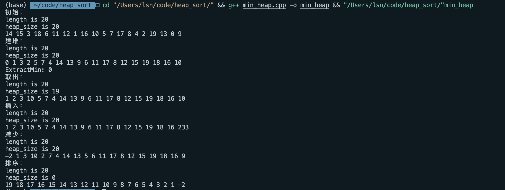
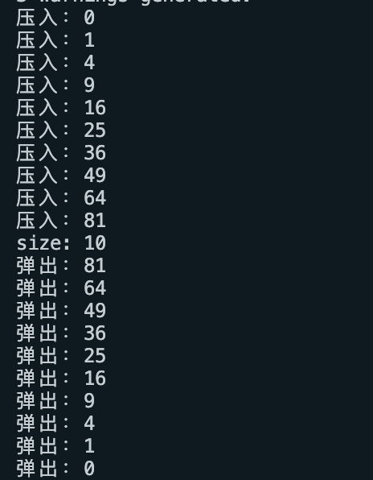

# 实验5

姓名：邵宁录&nbsp&nbsp&nbsp&nbsp&nbsp&nbsp&nbsp&nbsp&nbsp&nbsp&nbsp学号：2018202195

## 目录

1.  [实验内容](#一、实验内容)
2.  [实验思路](#二、实验思路)
3.  [问题与总结](#三、问题与总结)

## 一、实验内容

本次实验内容为参照算法导论第6章堆排序内容完成一个最小堆和用堆来实现一个栈。

## 二、实验思路

### 1. 最小堆

**1.1 数据结构**

~~~c++
// 最小堆
class MinHeap
{
private:
    int *A;
    int length;     // 堆数组总长度
    int heap_size;  // 堆数组当前长度

public:
    MinHeap(int length = MAX_LENGTH);
    ~MinHeap();
    // 最小堆的有关代码实现参考算法导论第六章最大堆的实现
    // heap
    void MinHeapify(int i); // 维护最小堆
    void BuildMinHeap();    // 构建最小堆
    void HeapSort();        // 堆排序
    // priority queue
    int HeapMinimum();      // 返回最小堆顶，即最小的数
    int HeapExtractMin();   // 取出堆顶
    void HeapDecreaseKey(int index, int key);   // 减小堆中某个index的值
    void HeapInsert(int key);   // 插入堆
    // 打印堆数组
    void PrintHeap();

private:
    inline int PARENT(int i);
    inline int LEFT(int i);
    inline int RIGHT(int i);
};
~~~

我们可以看到，最小堆的数据结构与书上最大堆应有的数据结构基本一致，没有什么不同，有三个私有变量组成：数组A、堆数组总长度length、堆数组当前长度heap_size。

**1.2 算法思路**

总的来说，在实现最小堆的时候，只要谨记跟书上最大堆的实现中，大多数比较符号反着来就可以了。

有三个非常重要的基本函数，即PARENT，LEFT，RIGHT。在计算时，我为了加快速度，采取了**位运算**。其算法如下：

~~~c++
inline int MinHeap::PARENT(int i)
{
    return ((i + 1) >> 1) - 1;
}

inline int MinHeap::LEFT(int i)
{
    return ((i + 1) << 1) - 1;
}

inline int MinHeap::RIGHT(int i)
{
    return ((i + 1) << 1);
}
~~~

其他算法与书上别无二致，可以参考书上内容实现。

**1.3 实验截图**

### 2. 用堆实现的栈

**2.1 数据结构**

**Node结点**

~~~c++
struct Node
{
    // node由键值对组成
    int key;    
    int value;  
    // 默认构造函数
    Node() = default;    
    // 自定义构造函数
    Node(int k, int v)
        :key(k), value(v)
    {
    }
};
~~~

**最大堆**

~~~c++
class MaxHeap
{
private:
    Node *A;
    int length;     // 堆数组总长度
    int heap_size;  // 堆数组当前长度

public:
    MaxHeap(int length = MAX_LENGTH);
    ~MaxHeap();
    // 最小堆的有关代码实现参考算法导论第六章最大堆的实现
    // heap
    void MaxHeapify(int i); // 维护最大堆
    void BuildMaxHeap();    // 构建最大堆
    // priority queue
    Node HeapMaximum();     // 返回最大堆顶，即最大的数
    Node HeapExtractMax();  // 取出堆顶
    void HeapIncreaseKey(int index, int key);   // 增大堆中某个index的值
    void HeapInsert(int key, int value);    // 插入堆
    // 辅助函数
    void PrintHeap();   // 打印堆数组
    int GetHeapSize();  // 返回堆数组当前打下

private:
    inline int PARENT(int i);
    inline int LEFT(int i);
    inline int RIGHT(int i);
};
~~~

**栈**

~~~c++
// 栈
class Stack
{
private:
    MaxHeap max_heap;

public:
    Stack() = default;
    ~Stack() = default;
    // 栈的基本功能
    void Push(int v);   // 入栈
    int Pop();          // 出栈
    int Top();          // 返回栈顶元素
    int Size();         // 栈大小
    bool Empty();       // 栈是否为空
    // 输出栈
    void Print();
};
~~~

**2.2 算法思路**

实现栈的过程非常简单，最大堆天然就可以成为一个栈。只需在压入第一个元素到最大堆时，给这个元素的key值设置为0，然后第二个元素压入时，给它的key值设置为1，以此类推。

这样子做的话，就可以借用最大堆的API，非常快的完成栈。

如栈的Pop功能：

~~~c++
int Stack::Pop()
{
    return this->max_heap.HeapExtractMax().value;
}
~~~

具体实现可以参考源文件。

**2.3 实验结果截图**

## 三、问题与总结

本次实验基本没有问题，因为实验内容较为简单，只需参考书上的伪代码，稍微经过自己的思考，就可以完成。

