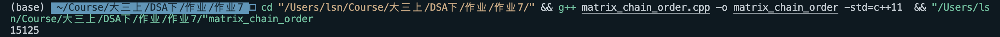

# 实验7 矩阵链乘法

姓名：邵宁录&nbsp&nbsp&nbsp&nbsp&nbsp&nbsp&nbsp&nbsp&nbsp&nbsp&nbsp学号：2018202195

## 目录
 1. [问题描述](#一问题描述)
 2. [算法基本思路](#二算法基本思路)
 3. [算法复杂度分析](#三算法复杂度分析)
 4. [源码](#四源码)
 5. [运行结果截图](#五运行结果截图)
 6. [问题与总结](#六问题与总结)

## 一、问题描述

实现矩阵链乘问题的备忘录算法。(用课件中的例题做测试)

**输入：** n个矩阵的大小，共有n+1个数，如[1, 2, 3, 4, 5]，表示4个矩阵的大小

**输出：** 最小的乘法次数

## 二、算法基本思路

算法的基本思路是利用 **备忘录** **自顶向下** 的技巧来减小计算的次数。

该动态规划问题的状态转移方程为：

$$m[i][j] =\min \{m[i][k] + m[k+1][j]+p[i]*p[k+1]*p[j+1]\}$$

因此只需按照上式写出代码即可，唯一需要注意的地方是，当 $i==j$ 时，函数返回 $0$ ，因为一个矩阵不需要做乘法。

## 三、算法法复杂度分析

由于算法实现的是带备忘录的自顶向下的解法，因此它对每个子问题都只求解一次，并且可知它求解了规模为 $n^2$ 的子问题（因为 $m[n][n]$ 是一个二维表），而对于每个子问题，又要遍历求解一次最小的值，于是乎，整个算法的时间复杂度为 $O(n^3)$ 。

## 四、源码

~~~c++
/*
 * @Description: 算法导论第15章矩阵链乘法实现
 * @Author: rainym00d
 * @Github: https://github.com/rainym00d
 * @Date: 2020-10-27 14:03:31
 * @LastEditors: rainym00d
 * @LastEditTime: 2020-10-29 20:21:28
 */

// 输入：n个矩阵的大小，共有n+1个数，如[1, 2, 3, 4, 5]
// 输出：最小的乘法次数

/*
 * @Description: 算法导论第15章矩阵链乘法实现
 * @Author: rainym00d
 * @Github: https://github.com/rainym00d
 * @Date: 2020-10-27 14:03:31
 * @LastEditors: rainym00d
 * @LastEditTime: 2020-10-31 22:01:30
 */

// 输入：n个矩阵的大小，共有n+1个数，如[1, 2, 3, 4, 5]
// 输出：最小的乘法次数

#include <iostream>
#include <cstdlib>
#include <vector>

using namespace std;

const int SUP = 23333333;
const int INF = -23333333;
const int N = 1024;

// 带备忘录的自顶向下
int m[N][N];

int LookupChain(vector<int> &p, int i, int j)
{
    if (m[i][j] < SUP)
    {
        return m[i][j];
    }
    if (i == j)
    {
        m[i][j] = 0;
    }
    else
    {
        for (int k = i; k < j; k ++)
        {
            // 状态转移方程
            int q = LookupChain(p, i, k) + LookupChain(p, k + 1, j) + p[i] * p[k + 1] * p[j + 1];
            if (q < m[i][j])
            {
                m[i][j] = q;
            }
        }
    }
    return m[i][j];
}

int MemoizedMatrixChain(vector<int> &p)
{
    int n = p.size() - 1;
    for (int i = 0; i < N; i ++)
    {
        for (int j = 0; j < N; j ++)
        {
            m[i][j] = SUP;
        } 
    }
    return LookupChain(p, 0, n - 1);
}

int main(int argc, char const *argv[])
{
    // 在这里输入矩阵的大小
    int a[] = {30, 35, 15, 5, 10, 20, 25};
    vector<int> p;
    for (int ai : a)
    {
        p.push_back(ai);
    }
    // 矩阵数量n
    int n = p.size() - 1;
    cout << MemoizedMatrixChain(p) << endl;
    
    return 0;
}

~~~

## 五、运行结果截图

## 六、问题与总结

总体来说，本次问题较为简单，整体思路也很清晰，很容易想明白，代码的实现几乎没有任何难度。

在实现带备忘录的自顶向下算法的同时，我还实现了自底向上的解法作为对比。两个算法在运行效率上来说差不多，但从代码的实现上来说，自顶向下会容易一些。因为自顶向下的算法用到了递归思想，代码逻辑会易懂一些。
