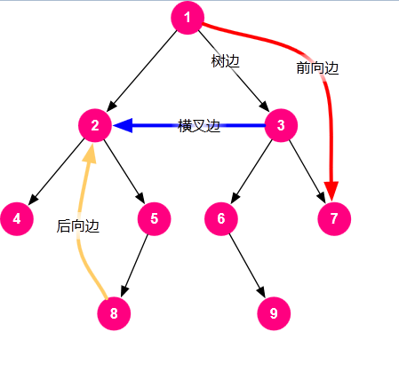
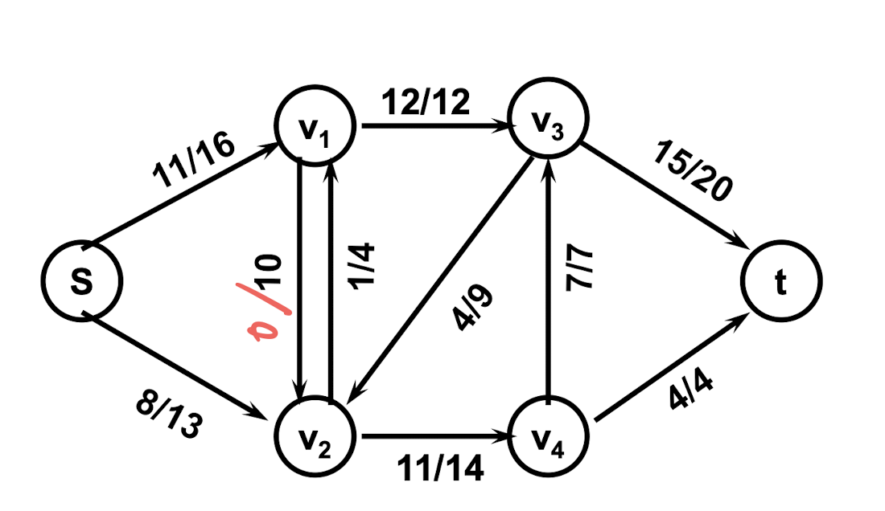
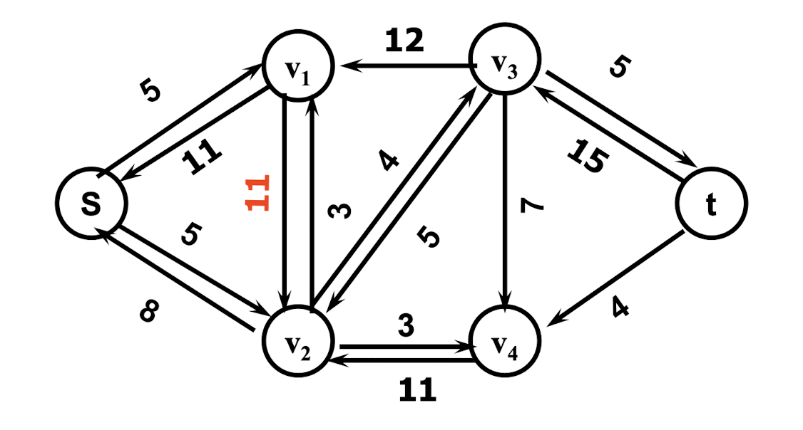

<h1>算法导论复习</h1>

[toc]

选择 20分 不定项选择  都是些基础概念
简答
分析 时间复杂度
证明题

算法导论中，树的深度定义为，第一层为0，然后下一层为1，类推
树的高度定义为，最底下为0，然后再1，类推

## 算法复杂度符号表示
## 递归与分治
### 递归式
- 表达与求解递归式时一般要忽略一些技术性细节
  - 函数自变量为整数，忽略上取整和下取整
  - 忽略边界条件，假设对于足够小的$n$，$T(n)$为常量
- 代入法
  - 先猜测有某个界存在，然后用数学归纳法证明猜测的正确性
  - 步骤
    - 猜测解的形式
    - 用数学归纳法证明，找出使解真正有效的常数
    - 确定常数使边界条件成立
  - 有些时候发现次数对了，但归纳的时候还差一点，那就加强归纳假设，把假设的式子**减去一个低阶项**
  - 有些时候还可以进行变量替换
- 迭代法
  - 把递归式转化为求和表达式，然后再求这个式子的边界
  - 步骤
    - 把递归式不断展开然后求和就可以了
  - 有时可以只展开部分，然后看出规律来用代入法
  - 有时递归式会包含向上取整或向下取整，这时候可以假设$n$是某个常数的幂次方来简化，如$n=2^k$
- 递归树法
  - 用树形结构直观地表达了迭代式
  - 每个结点都代表该步代价；每一层都是一次递归调用的结果；而把每一层中的结点都相加，就得到了该次递归调用的代价
  - 步骤
    - 不断地展开树，然后把每层相加
    - 把每层的结果求和
  - 严格意义上说，递归树法的结果需要再用代入法来验证
- 主方法
  - 给出了求解$T(n)=aT(\cfrac{n}{b})+f(n)$这种形式递归式的简单方法（就是可以直接套公式）
  - 其中，常数$a\ge1$和常数$b>1$，$f(n)$是一个渐进正函数。$\cfrac{n}{b}$可以是带取整符号的
  - 判断方法
    - 若对某个常数$\epsilon>0$，有$f(n)=O(n^{\log_{b}a-\epsilon})$，则$T(n)=\Theta(n^{\log_{b}a})$
    - 若$f(n)=O(n^{\log_{b}a})$，则$T(n)=\Theta(n^{\log_{b}a}\log n)$
    - 若对某常数$\epsilon>0$，有$f(n)=O(n^{\log_{b}a+\epsilon})$，且对某个常数$c<1$和所有足够大的$n$，有$af(\cfrac{n}{b})\le cf(n)$，则$T(n)=\Theta(f(n))$
### 分治策略
- Strassen矩阵乘法
  - 将计算两个$n$阶矩阵的乘积所需的时间减少到了$O(n^{log7})$
  - 可以将矩阵写为如下形式：
$$
\left[
\begin{matrix}
    C_{11}\ \ C_{12}\\
    C_{21}\ \ C_{22}
\end{matrix}
\right]=
\left[
\begin{matrix}
    A_{11}\ \ A_{12}\\
    A_{21}\ \ A_{22}
\end{matrix}
\right]
\left[
\begin{matrix}
    B_{11}\ \ B_{12}\\
    B_{21}\ \ B_{22}
\end{matrix}
\right]
$$
  - 传统的计算$C$会总共需要8次乘法以及4次加法，这样虽然可以递归解，但还是$O(n^3)$
  - Strassen矩阵乘法把其变成了7次乘法以及18次加法，由于加法开销比乘法小很多，因此复杂度下降了。参考第2章PPT第63页起
- 最大子数组
  - 在一个数组里边找一段合最大的数组，被称为最大子数组
  - 递归策略
    - 最大子数组位于中点左边：在中点左侧的数组进行递归
    - 最大子数组位于中点右边：在中点右侧的数组进行递归
    - 最大子数组位于中间：从中间往两边一个一个找
  - 递归式为$T(n)=2T(\cfrac{n}{2})+n$
- 大整数乘法
  - 主要思想是将一个数个拆成两半，如$ab$拆成$a$和$b$两部分
  - 递归策略
    - 给定两个数$X=ab$和$Y=cd$，则$XY=ac\cdot 10^n+(ad+bc)\cdot 10^{n/2}+bd$
    - 可以将其写为$XY=ac\cdot 10^n+((a-c)(b-d)+ac+bd)\cdot 10^{n/2}+bd$
    - 这样就从原本的4次乘法减少到3次乘法
    - 这里有个小细节，不使用$(a+c)(b+d)-ac-bd$来替换，是因为怕$a+c$和$b+d$产生进位，发生位数变化
  - 递归式为$T(n)=3T(\cfrac{n}{2})+O(n)$
- 多数算法
  - 给定一个大小为$n$的数组，找出其中出现次数超过$\cfrac{n}{2}$的元素
  - 蛮力法（暴力搜索）
    - 时间复杂度$O(n^2)$，空间复杂度$O(n)$
  - 哈希法
    - 时间复杂度$O(n)$，空间复杂度$O(n)$
  - 先排序再搜索
    - 如果多数存在，那么就是中位数。于是从中位数向左右两边搜索，看看是不是个数是不是超过一半
    - 时间复杂度$O(n\log n)$
  - 分治法
    - 思路
      - 分别找左边的多数与右边的多数。
      - 如果左边的结果等于右边的结果，那这个就是多数
      - 如果不一样则遍历该数组看看哪个是
    - 递归式$T(n)=2T(\cfrac{n}{2})+O(n)$。所以时间复杂度$O(n\log n)$，空间复杂度$O(n)$

## 概率分析与随机算法（不考）
## 排序与选择
### 堆排序
- 堆排序的关键是**堆**这种数据结构。一般来说可以用数组来实现堆
- 父节点与子结点的关系
  - $PARENT[i]=\lfloor i/2\rfloor$
  - $LEFT[i]=2i$，$RIGHT[i]=2i+1$
- 堆结构的基本操作
  - $MAX-HEAPIFY$：保持最大堆性质，$O(\log n)$
  - $BUILD-MAX-HEAP$：构造最大堆，$O(n)$
  - $HEAPSORT$：排序，$O(n\log n)$
  - $MAX-HEAP-INSERT$、$HEAP-EXTRACT-MAX$、$HEAP-INCREASE-KEY$、$HEAP-MAXIMUM$：都是$O(\log n)$
### 快速排序
### 线性时间排序
### 排序算法比较
### 中位数选择算法
## 动态规划
### 钢条切割
- 很简单的一个动态规划问题，PPT上有两种解法，其中第二种解法更好，因为同等效果下算的更少
  - 同时算切割后的左右两边
  - 只算切割后的一边
- 设钢条长度为$N$，$p_i$为长度为$i$的钢条价格，$r_i$是长度为$i$的切割方案的收益。递归式如下
$$
\begin{aligned}
    r_n=\max_{1\le i\le n}\{p_i+r_{n-i}\}
\end{aligned}
$$
- 时间复杂度为$O(n^2)$
### 矩阵链乘法
- 目的是为了让多个矩阵乘法计算中，乘法次数最少。乘法次数等于$a\times b\times c$
- 它可以变为一个分组问题，因为输入的是一串数字（代表矩阵的维度）。如$5，10，15，25$，这是3个矩阵的输入。
- 解题思路很清晰，在一个大的矩阵相乘中，分为俩小的，相当于划了一条线隔开，然后重复这个过程
- 设$m(i,j)$为第$i$到第$j$个数的分组，$p_i$为第$i$个数。递归式如下：
$$
    m(i,j)=\begin{cases}
        0&i=j\\
        \min_{i\le k<j}\{m(i,k)+m(k+1,j)+p_{i-1}\times p_k\times p_j\}&i<j
    \end{cases}
$$
- 时间复杂度为$O(n^3)$
### 最长公共子序列
- 最长公共子序列的定义自己搜一下，比较难说明白
- 思路比较难想。设序列$X=(x_1,x_2,\ldots,x_m)$，$Y=(y_1,y_2,\ldots,y_n)$和$Z=(z_1,z_2,\ldots,z_k)$，其中，$Z$是$X$和$Y$的一个$LCS$
  - 若$x_m=y_n$，则$z_k=x_m=y_n$且$Z_{k-1}$是$X_{m-1}$和$Y_{n-1}$的一个$LCS$
  - 若$x_m\neq y_n$且$z_k\neq x_m$，则$Z$是$X_{m-1}$和$Y$的一个$LCS$
  - 若$x_m\neq y_n$且$z_k\neq y_n$，则$Z$是$X$和$Y_{n-1}$的一个$LCS$
- 这个证明在PPT第6章第79页，记得看一看
- $c(i,j)$为$X_i$和$Y_j$的$LCS$。递归式如下：
$$
\begin{aligned}
    c(i,j)=\begin{cases}
        0&i=0,j=0\\
        c(i-1,j-1)+1&i,j>0;x_i=y_j\\
        \max\{c(i,j-1),c(i-1,j)\}&i,j>0;x_i\neq y_j
    \end{cases}
\end{aligned}
$$
- 时间复杂度为$O(mn)$
### 最优二叉搜索树
- 问题描述
  - 给定$n$个关键字以及它们的频率$p_i$，把它们构造成一棵树，令搜索代价最小。注意，同时还给定了$n+1$个伪关键字以及它们的频率$q_i$。
  - 搜索代价如下。其中，$k_i$与$d_i$分别为关键字结点和伪关键字结点：
$$
E(T)=\sum_{i=1}^n(depth_T(k_i)+1)\cdot p_i+\sum_{i=0}^n(depth_T(d_i)+1)\cdot q_i
$$
  - 由于有$\sum_{i=1}^np_i+\sum_{i=0}^nq_i=1$，因此上式可以写为：
$$E(T)=\sum_{i=1}^ndepth_T(k_i)\cdot p_i+\sum_{i=0}^ndepth_T(d_i)\cdot q_i+1
$$
- 下边$w(i,j)=p_r+w(i,r-1)+w(r+1,j)$。递归式如下：
$$
\begin{aligned}
  w(i,j)&=\sum_{l=i}^jp_l+\sum_{l=i-1}^jq_l\\\\
  e(i,j)&=\begin{cases}
    q_i-1&，若j=i-1\\
    e(i,r-1)+e(r+1,j)+w(i,j)&，若i\le j
  \end{cases}
\end{aligned}
$$
- 时间复杂度为$O(n^3)$。算的时候和矩阵链乘法差不多
### 0-1 背包问题
- 递归式如下：
$$
\begin{aligned}
    m(i, W)=\begin{cases}
        0&i=0\\
        0&W=0\\
        m(i-1,W)&w_i>W\\
        \max\{m(i-1,W), m(i-1,W-w_i)+v_i\}&w_i\le W
    \end{cases}
\end{aligned}
$$
- 时间复杂度为$O(cn)$（$c$是总容量）
## 贪心算法
### 算法原理
- 能贪心的，必能动态规划
- 贪心需要满足两点
  - 最优子结构性质
    - $A_n$是最优解，那么根据$A_n$导出的子问题$A_{n-1}$，也一定是最优解（就是$A_{n-1}$的解被$A_n$的解包含）
  - 贪心选择性质
    - $X_n$是贪心解，并且$X_n$是最优解之一（可以去证明$X_n$与$A_n$相同，也可以去证明$X_n$是最优解之一）
### 活动选择
- 按照活动的结束时间排序，每一步都选择最早结束的活动
- 最优子结构
  - 令$S_{ij}$为$a_i$结束之后，$a_j$开始之前的活动集合。它的最优解为$A_{ij}$。假定$a_k$属于$A_{ij}$，那么就可以导出两个子问题：$S_{ik}$与$S_{kj}$的最优解$A_{ik}$与$A_{kj}$。
  - 显然有$A_{ij}=A_{ik}\cup A_{kj}\cup a_k$
  - 其中，我们要**明确最优子结构的特点**：$|A_{ij}|$要最大
  - 用**剪切-粘贴法**证明：$A_{ik}$和$A_{kj}$分别也是子问题$S_{ik}$和$S_{kj}$的最优解。
  - 以$S_{ik}$为例子，若不是，则存在$A_{ik}'$是$S_{ik}$的最优解，有$|A_{ik}'|>A_{ik}$。那么，$S_{ij}$的最优解应到为$A_{ik}'\cup A_{kj}\cup a_k$。显然，有$|A_{ik}'\cup A_{kj}\cup a_k|>A_{ij}$，这与$A_{ij}$是$S_{ij}$的最优解矛盾
  - 即证
- 贪心选择
  - 令$a_m$是$S_{ij}$中结束时间最早的一个活动，$A_{ij}$是$S_{ij}$的一个最优解，其中$a_m'$是$A_{ij}$中结束时间最早的活动
  - 如果$a_m=a_m'$，即证·
  - 如果$a_m\neq a_m'$，则有$a_m.f\le a_m'.f$，因此将$a_m'$替换为$a_m$也是一个最优解，即证
### 赫夫曼编码
- 形成最优的前缀编码
- 最优子结构
  - 令$C$为一个给定的字母表，$x$和$y$是$C$中频率最低的两个字符。令$C'$为$C$去掉字符$x$和$y$，加入一个新字符$z$后得到的一个字母表，即$C'=C-\{x,y\}\cup\{z\}$。其中，$z.freq=x.freq+y.freq$。令$T$为字母表$C$的一个最优前缀码对应的编码树。我们可以将$x$和$y$这个节点替换为$z$，那么就导出了子问题：$T'$是$C'$的一棵最优前缀编码树
  - **最优子结构的特点：** 有$B(T)$最小
  - 若$T'$不是最优前缀编码树，则存在$T''$为最优前缀编码树，有$B(T'')<B(T')$。将$T''$中的$z$换成$x$和$y$的一个结点，记这个新的数为$T'''$。
  - 则有$B(T''')=B(T'')+x.freq+y.freq<B(T')+x.freq+y.freq=B(T)$。即$B(T''')<B(T)$，这与$T$是最优前缀编码树矛盾，因此假设不成立。
  - 即证
- 贪心选择
  - 令$C$是一个给定的字母表，$x$和$y$是$C$中频率最低的两个字符，不失一般性，不妨令$x.freq<y.freq$。令$T$为$C$的一棵最优前缀编码树，其中$a$和$b$为$T$中深度最大的点，不失一般性，不妨令$a.freq<b.freq$
  - 我们要证明的就是可以由$T$转换成我们的贪心选择，即证明贪心选择也是一个最优解
  - 根据以上的大小关系定义，我们有$x.freq\le a.freq$且$y.freq\le b.freq$。若可以直接取到等号，那就不用证了，所以下边讨论取不到等号的情况
  - 我们把$a$和$x$交换形成一棵新树$T'$，再把$b$和$y$交换形成一棵新树$T''$。则对于$T$与$T'$，有如下式子：
$$
\begin{aligned}
  B(T)-B(T')&=\sum_{c\in C}c.freq\cdot d_T(c)-\sum_{c\in C}c.freq\cdot d_{T'}(c)\\
  &=x.freq\cdot d_T(x)+a.freq\cdot d_T(a)-x.freq\cdot d_{T'}(x)-a.freq\cdot d_{T'}(a)\\
  &=x.freq\cdot d_T(x)+a.freq\cdot d_T(a)-x.freq\cdot d_{T}(a)-a.freq\cdot d_{T}(x)\\
  &=(a.freq-x.freq)(d_T(a)-d_T(x))\\
  &\ge 0
\end{aligned}
$$
  - 同理，有$B(T)\ge B(T'')$。又由于$T$是最优前缀编码树，有$B(T)\le B(T'')$，因此根据夹逼定理，有$B(T)=B(T'')$
  - 即证
## 摊还分析（不考）
## 图算法
### 图的基本算法
- 图的表示
  - 邻接表
  - 邻接矩阵
  - **图的表示有很大讲究，不同的表示方法会带来不同的时间复杂度**
- 广度优先搜索
  - 时间复杂度
    - 邻接表：$O(V+E)$
    - 邻接矩阵：$O(V^2)$
  - 遍历规则（要注意一下，与平常的BFS有点点不同，需要**染色**）
    - 初始化，所有结点都为白色
    - 已经发现的点涂成灰色（就是第一次被访问到的点涂灰，加入队列的那个）
    - 已经展开所有相邻结点的点，涂成黑色（第二次访问到的涂黑，出队列的那个）
    - $v.d$存$s$到$v$的距离。$v.\pi$存路径中，$v$之前的那个点
  - BFS找到的最短路径，不是权重最短，是边的数量最短。而且不一定所有的点都有路径
  - 前驱子图
    - 由$v.\pi\neq NULL$的点加上源点$s$构成。是一棵树，因此也被成为**广度优先树**。相当于是由路径构成的一棵树
    - 利用这棵树，可以递归地打印出路径
- 深度优先搜索
  - 时间复杂度
    - 邻接表：$O(V+E)$
    - 邻接矩阵：$O(V^2)$
  - 遍历规则（也需要染色）
    - 初始化时，所有结点都是白色
    - DFS会给每个结点盖上俩时间戳
      - 第一个时间戳$v.d$记录第一次被发现的时间（涂灰色）
      - 第二个时间戳$v.f$记录完成对$v$扫描的时间
    - 所以很显然，$v.d<v.f$
  - 前驱子图
    - 由所有点构成，并且边就是路径。形成一个**深度优先森林**
    - 利用这个森林，可以递归地打印出路径
  - 边的分类
    - **树边：** 就是出现在树上的边
    - **后向边：** 在图中，会有一条边指向它的祖先结点，但不在树中出现
    - **前向边：** 在图中，会有一条边指向它的后代结点，但不在树中出现
    - **横向边：** 连接树中无关系的分支

- 拓扑排序
  - 只适用于有向无环图（DAG），**时间复杂度为DFS的时间加排序的时间**
  - 算法过程
    - DFS
    - 按$v.f$降序排列，就是拓扑偏序的结果
  - 为什么是降序？
    - 因为$v.f$大，说明完成的迟，但遇到的早，所以放前面
- 强连通分量
  - **时间复杂度为DFS加上排序的时间**
  - 算法过程
    - DFS
    - 生成转置图$G^T$
    - 对$G^T$进行DFS，选择点的顺序为$v.f$降序
    - 生成的深度优先森林中，每一棵树都是一个强连通分量
### 最小生成树
- 最小生成树的定义：找到一棵树，该树的权重最小
- Prim算法
  - 相当于根据边选择点
  - 算法过程
    - 初始化建堆
    - 开始循环
    - 用`EXTRACT-MIN`找出目标结点
    - 更新目标结点的邻居结点的权重（`DECREASE-KEY`）
    - 循环直至图被遍历完
  - 时间复杂度分析
    - 建堆的复杂度为$O(V)$
    - `EXTRACT-MIN`的复杂度是$O(\lg V)$，，总共会调用$O(V)$次
    - `DECREASE-KEY`的复杂度为$O(\lg V)$（最小堆）或者$O(1)$（斐波那契堆），总共会调用$O(E)$次。
    - 因此，总的时间复杂度为$O(V+V\lg V+E\lg V)$或者$O(V+V\lg V+E)$（一般来说可以写成$O(E\lg V)$或者$O(E+V\lg V)$）
- Kruskal算法
  - 相当于根据点选边
  - 算法过程
    - 初始化将每个点都归入一个集合（`MAKE-SET`）
    - 对所有的边进行升序排列
    - 开始循环
    - 如果这条边的两个端点不属于同一个集合（`FIND-SET`），那就将它们合并（`UNION`）
    - 循环直至所有的边被遍历完（其实可以优化成只剩一个集合）
  - 时间复杂度分析
    - `MAKE-SET`要对所有的点做一遍，因此是$O(V)$
    - 排序$O(E\lg E)$
    - `FIND-SET`最坏情况为$O(\lg N)$（**我不知道为什么**）
    - `UNION`最坏情况也是$O(\lg N)$（**我也不知道为什么**）
    - **这时间复杂度分析晕了，搞明白了再写**
### 单源最短路径
- 一些应该知道的东西
  - 最短路径的子路径也是最短路径（可以用剪切-粘贴法来证明）
  - 如果不包含负权重的环路，那么最短路径都有**精确定义**，值是负数也没有关系；有负权重的环路的话，就定义为负无穷
- Bellman-Ford算法
  - 算法描述
    - 可处理任意带权图（负权重也可以）
    - 循环$|V|-1$轮后还可以迭代意味着有负的环
    - 时间复杂度为$O(VE)$
  - 算法过程
    - 初始化所有结点
    - 开始循环$|V|-1$次
    - 对所有的边做一次松弛操作（`RELAX`）
    - 循环结束后，再对所有的边做一次松弛操作（`RELAX`），若还能做，则说明有负的环，返回$FALSE$
    - 返回$TRUE$
  - 时间复杂度分析
    - 初始化的时间复杂度为$O(V)$
    - 一次`RELAX`的时间复杂度为$O(1)$，每轮有$|E|$次，所以是$O(E)$
    - 因此，总的时间复杂度为$O(EV)$
  - 该算法可以在有向无环图（DAG）中进行优化
    - 先进行拓扑排序（根据存图的形式，$O(V+E)$或者$O(V^2)$）
    - 初始化
    - 开始循环
    - 按照图谱排序的顺序选择结点$u$
    - 对所有$u$以及它的所有邻居结点$v$进行松弛操作（`RELAX`）
    - 直至所有的$u$都被循环了一遍，循环结束
    - 因此总共算下来，是$O(V+E)$（按照邻接表来算）
- Dijkstra算法
  - 算法描述
    - 要求所有的边的权重都是非负值
    - 和Prim算法很像，可以说几乎是一模一样，只有在处理结点的$key$的时候有一点区别，要注意区别（**Prim只管边的长度，Dijkstra要管边的长度加当前结点本身的权值**）
  - 算法过程
    - 初始化建堆
    - 开始循环
    - 用`EXTRACT-MIN`找出目标结点
    - 对目标结点的邻居结点进行松弛操作（`RELAX`），由于是堆，因此松弛操作中的权值改变用的是`DECREASE-KEY`。
    - 循环直至图被遍历完
  - 时间复杂度分析
    - 和Prim算法差不多，参考那边的就可以了
### 所有结点对的最短路径
- Floyd-Warshall算法
  - 算法描述
    - 是一个动态规划算法
    - 时间复杂度为$O(n^3)$
    - 空间复杂度为$O(n^3)$，但可以优化成$O(n^2)$，因为不需要存所有的矩阵
  - 递归表达式
$$
\begin{aligned}
  d^{(0)}(i,j)&=\begin{cases}
    0&,i=j\\
    w(i,j)&,i\neq j
  \end{cases}\\\\
  d^{(k)}(i,j)&=\min\{d^{(k-1)}(i,j), d^{(k-1)}(i,k)+d^{(k-1)}(k,j)\}
\end{aligned}
$$
  - 算法过程
    - 初始化（将输入的矩阵赋值给$D^{(0)}$）
    - 三层循环算新的$D$。最外层代表循环$n$次，里面两次代表算矩阵
  - 时间复杂度分析
    - 没什么好分析的，这个很容易看出来就是$O(n^3)$
- Johnson算法
  - 算法描述
    - 可处理任意带权图（**负权重也可以，但不能有负的环**），比较适合稀疏图
    - Johnson算法所用的技术为**重新赋予权值**
    - 如果图上没有负的权重，那就相当于对每个结点跑一遍Dijkstra
    - 如果有负的权重，那就需要重新计算赋予新的权重
  - 算法过程
    - 如果图上无负值，跳过这一步；如果有负值，那就引入一个虚假的结点$S$，连接结点$S$和所有点，这些边的权重为0
    - 以S为源点跑一遍Bellman-Ford，得到$S$到每个点的最短距离，不妨记为$h(v)$
    - 计算新的权重，公式为$W(u,v)'=W(u,v)+h(u)-h(v)$
    - 对每个结点跑一次Dijkstra
  - 时间复杂度分析
    - 执行$|V|$次Dijkstra的时间复杂度
    - 当$|E|$足够小时（即比较稀疏的时候），会比Floyd-Warshall快
## 最大流
### 流网络的基本概念
- 流网络是一个具备下述特征的有向图$G=(V,E)$
  - 每条边$(u,v)\in E$，有一个非负容量（capacity），用$c(u,v)>0$来表示。对于不在$E$中的$(u,v)$，规定$c(u,v)=0$
  - 存在单一源点$s\in V$
  - 存在单一汇点$t\in V$
  - 除了$s$和$t$之外的其他结点称为内部结点
- 三点假设
  - 没有边进入源点$s$，也没有边离开汇点$t$
  - 每个结点至少存在一条边与之相连，$G$为连通图，且$|E|\ge|V|-1$
  - 所有的容量都是整数
- 流的定义
  - 一个$s-t$流是一个实值函数$f$，它把每条边映射到一个实数，$f:V\times V\rightarrow R$。
  - 满足三个性质
    - **容量限制：** 要求$f(u,v)\le c(u,v)$
    - **反对称性：** $f(u,v)=-f(v,u)$
    - **流守恒性：** 对于所有的$u\in V-\{s,t\}$，要求$\sum_{v\in V}f(u,v)=0$。就是说我多少流进去，就要有多少流出来

### Ford-Fulkerson算法
- 算法描述
  - 是一个最大流算法，即求一个流网络的最大流
- 剩余网络
  - 用$G_f$来表示。剩余网络由流网络导出，描述的是一个无流网络，其网路上的容量定义为$c_f(u,v)=c(u,v)-f(u,v)$

- 增广路径
  - 剩余网络$G_f$中$s$到$t$的一条简单路径
  - 增广路径$p$的剩余容量：$c_f(p)=\min\{c_f(u,v):(u,v)在路径$p$上\}$。就是取最小的那段路径的容量为其容量
  - 可以由增广路径$p$，定义流函数$f_p$，如下
$$
\begin{aligned}
  f_p(u,v)=\begin{cases}
    c_f(p)&,如果(u,v)在p上\\
    -c_f(p)&,如果(v,u)在p上\\
    0&,其他
  \end{cases}
\end{aligned}
$$

- 流增广
  - 用增广路径导出的流函数$f_p$对原来的流网络进行更新，定义为$f'=f+f_p$

- 算法描述
  - 初始化，将网络中的流初始化为0
  - 当剩余网络中存在简单路径时，开始循环
  - 找到一条增广路径，并用这条增广路径导出的流函数做流增广
  - 当剩余网络中不存在简单路径时，循环结束
- 时间复杂度分析
  - 设网络的最大流为$f*$，则增广次数会小于等于$|f*|$。那么算法的时间复杂度为$O(E|f*|)$
  - 这不是一个多项式时间，它与$|f*|$有关。
  - 但可以改进，Edmonds-Karp算法将其变为了$O(VE^2)$，改法是找增广路径的时候用BFS来找

### 最大二分匹配
- 算法过程
  - 增加一个源点$s$，从$s$拉一条边到$L$的每个顶点
  - 将$L$到$R$的边改为有向边
  - 增加一个汇点$t$，从$R$的每个顶点拉一条边到$t$
  - 将所有边的容量设置为1
  - 跑Ford-Fulkerson算法，算出来的最大流，就是一个最大二分匹配
## NP完全理论