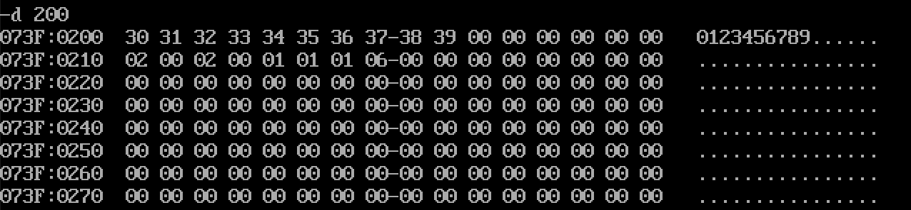

# 计组11

姓名：邵宁录&nbsp&nbsp&nbsp&nbsp&nbsp&nbsp&nbsp&nbsp&nbsp&nbsp&nbsp学号：2018202195

## 第一题

### 程序代码

~~~x86asm
MOV CX, 8
MOV SI, 200
MOV DI, 301
XXX:
    MOV AL, [SI]
    MOV [DI], AL
    INC SI
    INC SI
    INC DI
    INC DI
    DEC CX
    JNZ XXX
INT 3
~~~

### 运行结果

## 第二题

### 程序代码

~~~x86asm
MOV CX, 8
MOV SI, 207
MOV DI, 209
XXX:
    MOV AL, [SI]
    MOV [DI], AL
    DEC SI
    DEC DI
    DEC CX
    JNZ XXX
INT 3
~~~

### 运行结果

**运行前**：

**运行后**：

## 第三题

### 程序代码

~~~x86asm
MOV CX, 4
MOV SI, 200
MOV DI, 207
XXX:
    MOV AL, [SI]
    XCHG AL, [DI]
    MOV [SI], AL
    INC SI
    DEC DI
    DEC CX
    JNZ XXX
INT 3
~~~

### 运行结果

**运行前**：

**运行后**：

## 第四题

### 程序代码

~~~x86asm
MOV BX, 200
MOV CX, 8
MOV DI, 210
XXX:
    MOV AL, [DI]
    XLAT
    MOV [DI], AL
    INC DI
    DEC CX
    JNZ XXX
INT 3
~~~

### 运行结果

**运行前**：

**运行后**：

