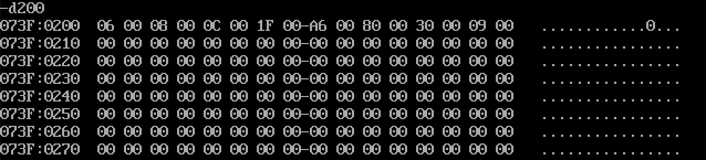
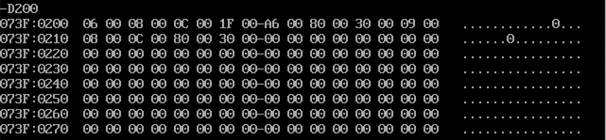
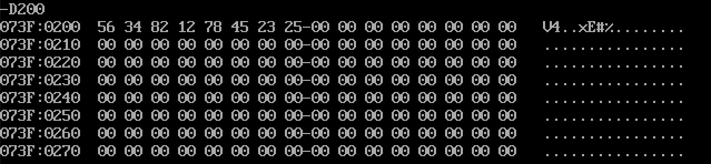
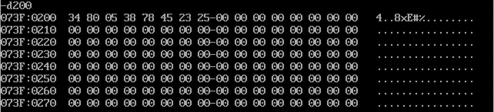
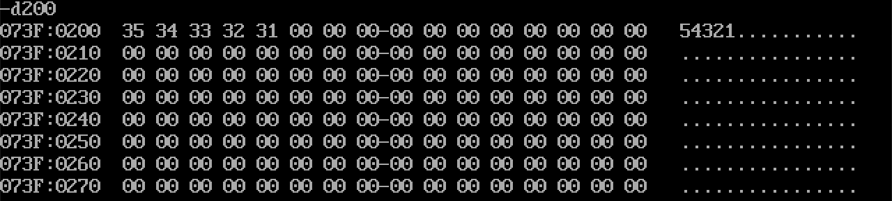
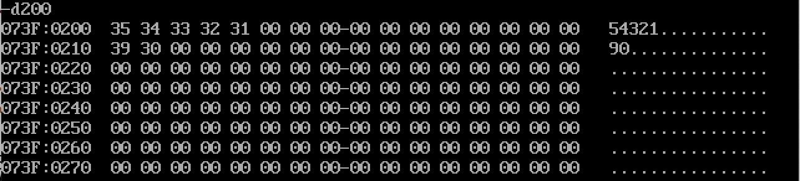
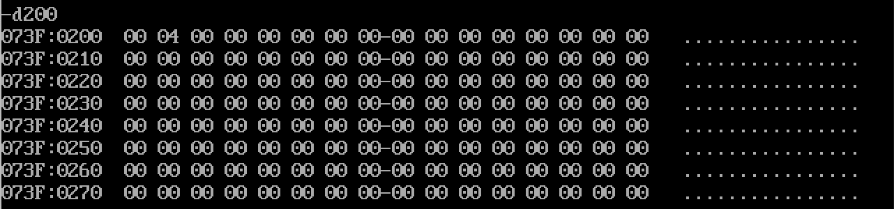
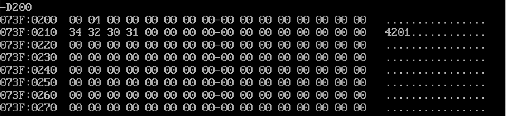

# 计组12

姓名：邵宁录&nbsp&nbsp&nbsp&nbsp&nbsp&nbsp&nbsp&nbsp&nbsp&nbsp&nbsp学号：2018202195

## 第一题

### 程序代码

~~~x86asm
MOV CX, 8
MOV SI, 200
MOV DI, 210
XXX1:
    MOV WORD PTR AX, [SI]
    MOV DL, 4
    DIV DL
    CMP AH, 0
    JNZ XXX2
    MOV WORD PTR DX, [SI]
    MOV WORD PTR [DI], DX
    INC DI
    INC DI
XXX2:
    INC SI
    INC SI
    DEC CX
    JNZ XXX1
INT 3
~~~

### 运行结果

**运行前**：

**运行后**：

## 第二题

### 程序代码

~~~x86asm
MOV CX, 4
MOV SI, 200
MOV DI, 204
ADD AL, 0
XXX:
    MOV AL, [SI]
    ADC AL, [DI]
    DAA
    MOV [SI], AL
    INC SI
    INC DI
    DEC CX
    JNZ XXX
INT 3
~~~

### 运行结果

**运行前**：

**运行后**：

## 第三题

### 程序代码
采用小端存放
~~~x86asm
MOV CX, 5
MOV SI, 204
MOV DI, 210
MOV AX, 0
XXX:
    MOV DX, A
    MUL DX
    MOV DX, 0
    MOV DL, [SI]
    SUB DL, 30
    ADD AX, DX

    DEC SI
    DEC CX
    JNZ XXX
MOV [DI], AX
INT 3
~~~

### 运行结果

**运行前**：

**运行后**：

## 第四题

### 程序代码
要注意确保除法不溢出
~~~x86asm
MOV SI, 200
MOV DI, 210
MOV WORD PTR AX, [SI]
MOV DL, A
XXX:
    DIV DL
    ADD AH, 30
    MOV [DI], AH
    MOV AH, 0
    INC DI
    CMP AL, 0
    JNZ XXX
INT 3
~~~

### 运行结果

**运行前**：

**运行后**：

