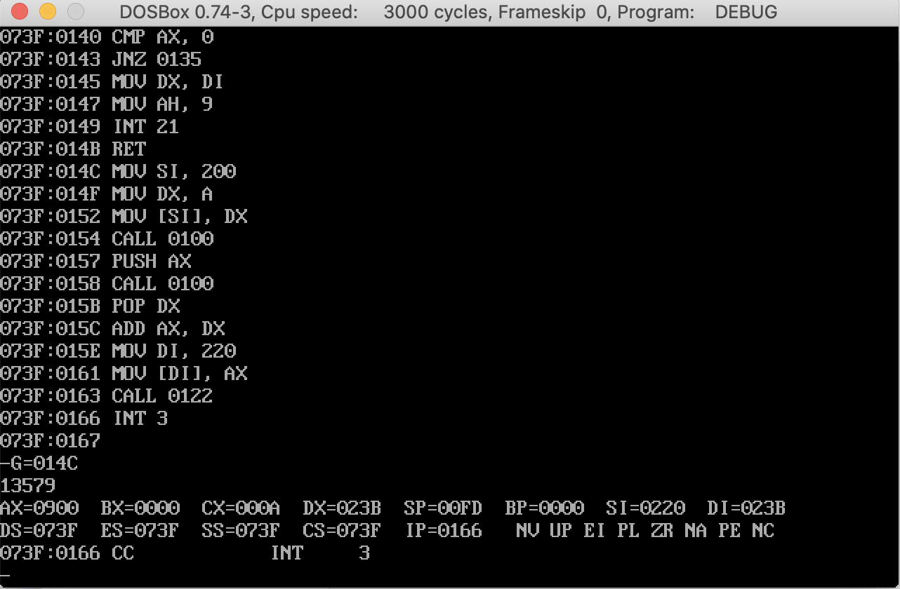

# 计组13

姓名：邵宁录&nbsp&nbsp&nbsp&nbsp&nbsp&nbsp&nbsp&nbsp&nbsp&nbsp&nbsp学号：2018202195

## 第一题

### 程序代码

~~~x86asm
XXX1:   0100
    MOV DX, 200
    MOV AH, A
    INT 21
    MOV SI, 201
    MOV CL, [SI]
    MOV AX, 0
XXX11:    010F
    INC SI
    MOV DX, A
    MUL DX
    MOV DX, 0
    MOV DL, [SI]
    SUB DL, 30
    ADD AX, DX
    LOOP XXX1
    RET
XXX2:   0122
    MOV SI, 220
    MOV DI, 240
    MOV DX, 24
    MOV [DI], DX
    MOV DX, 0
    MOV WORD PTR AX, [SI]
    MOV CX, A
XXX22:  0135
    DEC DI
    DIV CX
    ADD DL, 30
    MOV [DI], DL
    MOV DX, 0
    CMP AX, 0
    JNZ XXX22

    MOV DX, DI
    MOV AH, 9
    INT 21
    RET
014C
MOV SI, 200
MOV DX, A
MOV [SI], DX
CALL XXX1
PUSH AX
CALL XXX1
POP DX

ADD AX, DX
MOV DI, 220
MOV [DI], AX

CALL XXX2
INT 3
~~~

### 运行结果

**运行结果**：

## 第二题

## 程序代码

~~~x86asm
input1:
    mov dx,200
    mov ah,a
    int 21
    int 3
input2:
    mov dx,210
    mov ah,a
    int 21
    int 3

bcdadd:
    mov si,20B
    mov di,21B
    mov ax,0
    mov dx,0
    mov cx,10
    # CF清零
    add ax,0
    xxx:
        mov al,[si]
        mov dl,[di]
        adc al,dl
        aaa
        mov [di],al
        dec si
        dec di
        loop xxx
        int 3

bcdToasc:
    mov si,21B
    mov ax,0
    mov dx,0
    mov cx,10
    add ax,0
    xxx:
        mov al,[si]
        add al,30
        dec si
        loop xxx
    # 添加结束字符
    mov al,24
    mov [21C],al
    int 3

output:
    mov dx,212
    mov ah,9
    int 21
    int 3

call input1
call input2
call bcdadd
call bcdToasc
call output
~~~

