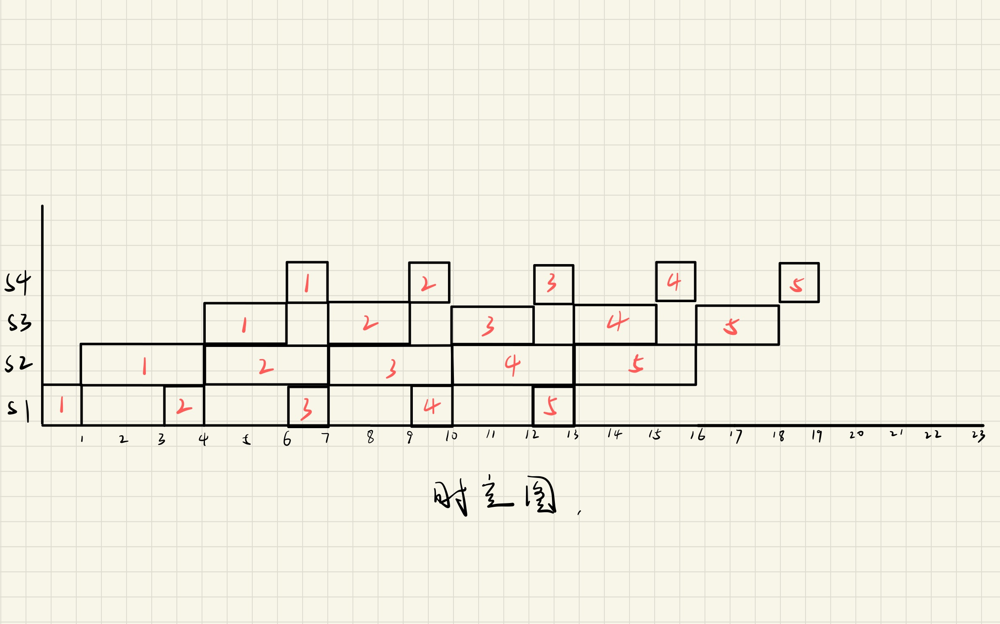

# 计组14

***

姓名：邵宁录&nbsp&nbsp&nbsp&nbsp&nbsp&nbsp&nbsp&nbsp&nbsp&nbsp&nbsp学号：2018202195

### 第一题

#### 1.1 push ri

4个机器周期。
1. 取指周期：
   1. $PC\rightarrow AB$
   2. $W/R\#=0$
   3. $M/IO\#=1$
   4. $DB\rightarrow IR$
   5. $PC+1$
2. 准备栈指针周期
   1. $sp\rightarrow ALU$
   2. $"+"\rightarrow ALU$
   3. $ALU\rightarrow AR$
   4. $sp+1$ 
3. 准备栈数据周期
   1. $PC\rightarrow ALU$
   2. $"+"\rightarrow ALU$
   3. $ALU\rightarrow DR$
4. 压栈周期
   1. $AR\rightarrow AB$
   2. $DR\rightarrow DB$
   3. $W/R\#=1$
   4. $M/IO\#=1$

#### 1.2 mov ri，\[[rj+disp]]

6个机器周期。
1. 取指周期（同上）
2. 第一次准备地址
   1. $rj\rightarrow GR$
   2. $(rj)\rightarrow ALU$
   3. $disp\rightarrow ALU$
   4. $"+"\rightarrow ALU$
   5. $ALU\rightarrow AR$
3. 第一次读取存储器
   1. $AR\rightarrow AB$
   2. $W/R\#=0$
   3. $M/IO\#=1$
   4. $DB\rightarrow DR$
4. 第二次准备地址
   1. $DR\rightarrow ALU$
   2. $"+"\rightarrow ALU$
   3. $ALU\rightarrow AR$
5. 第二次读取存储器
   1. $AR\rightarrow AB$
   2. $W/R\#=0$
   3. $M/IO\#=1$
   4. $DB\rightarrow DR$
6. 送结果
   1. $DR\rightarrow ALU$
   2. $"+"\rightarrow ALU$
   3. $ri\rightarrow GR$
   4. $ALU\rightarrow GR$

#### call cc @disp

若 $cc$ 成立，则有5个机器周期；反之，则有1个机器周期
1. 取指周期（同上）
2. 准备栈指针周期
   1. $sp\rightarrow ALU$
   2. $"+"\rightarrow ALU$
   3. $ALU\rightarrow AR$
   4. $sp+1$
3. 准备栈数据周期
   1. $PC\rightarrow ALU$
   2. $"+"\rightarrow ALU$
   3. $ALU\rightarrow DR$
4. 压栈周期
   1. $AR\rightarrow AB$
   2. $DR\rightarrow DB$
   3. $W/R\#=1$
   4. $M/IO\#=1$
5. 计算转移地址周期
   1. $PC\rightarrow ALU$
   2. $disp\rightarrow ALU$
   3. $"+"\rightarrow ALU$
   4. $ALU\rightarrow PC$

### 第二题

时空图如下，其中横坐标中单位1代表50ns

**实际吞吐率**

由于该流水线每个任务执行的时间不等，所以用以下公式进行计算。

$$
\begin{aligned}
    T_p
    &=n/[(m+3n)\Delta{t}]\\
    &=5/[(4+3\times 5)\times 50]\\
    &=5/(19\times 50)\\
    &\approx0.0053
\end{aligned}
$$

**最大吞吐率**

$$
\begin{aligned}
    T_{p_{max}}
    &=1/(3\times 50)\\
    &\approx0.005
\end{aligned}
$$

**加速比**

$$
\begin{aligned}
    S
    &=T_0/T_m\\
    &=7\times 5/19\\
    &\approx1.84
\end{aligned}
$$

**效率**

$$
\begin{aligned}
    \eta
    &=所有占用格数/总格数\\
    &=(5*1+5*3+5*2+5*1)/(4*19)\\
    &=35/76\\
    &\approx0.４６
\end{aligned}
$$

最主要的瓶颈是在第2段，次要的瓶颈是在第3段。