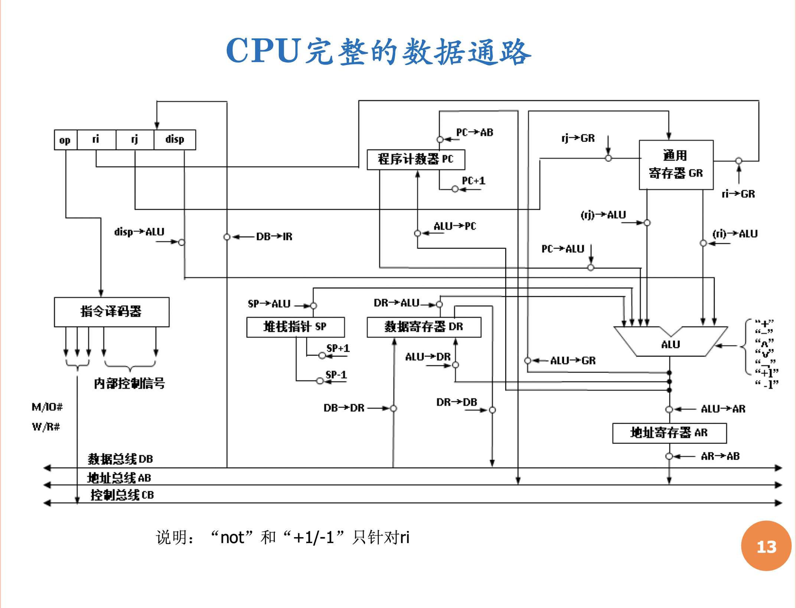
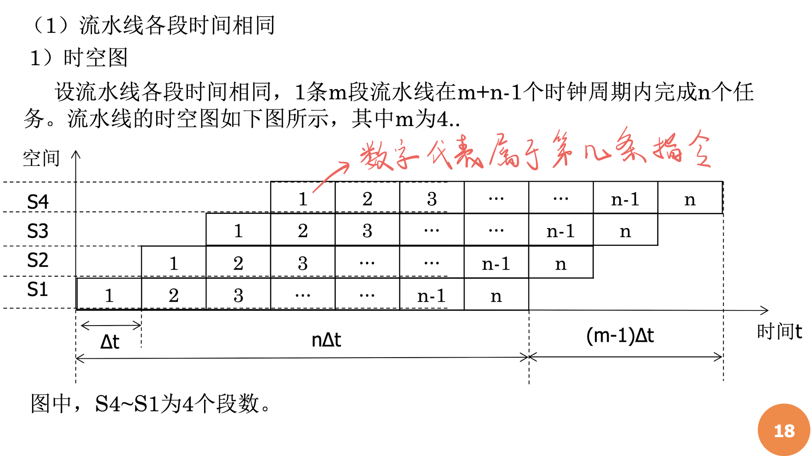
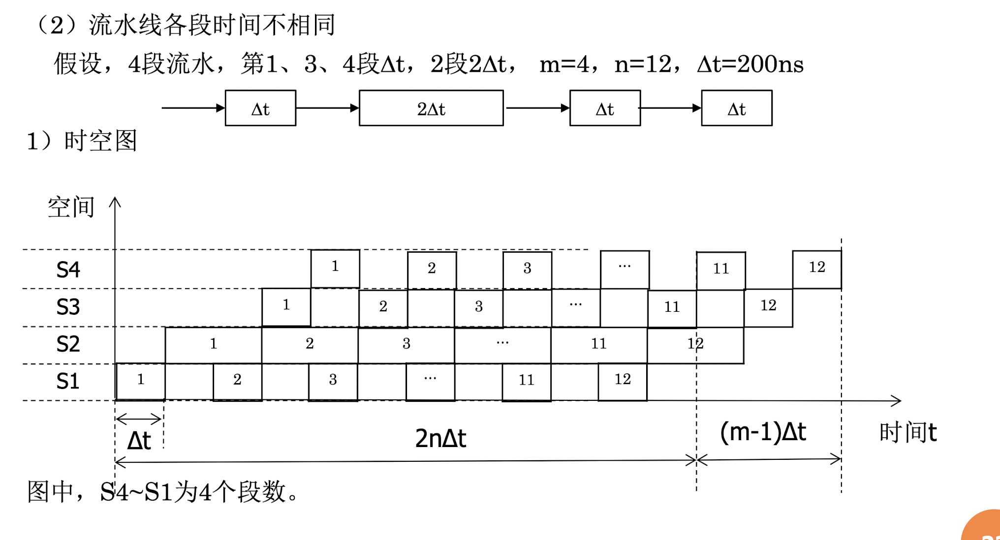

<h1>处理机</h1>

[toc]

## CPU的组成
- **运算器部分**
  - 寄存器组
  - ALU
- **控制器部分**
  - 程序计数器$PC$（存放下一条指令的地址）
  - 指令寄存器$IR$（存放当前正在执行的指令）
  - 操作码译码器（对正在执行的指令$op$部分译码）
  - 控制信号产生部件（产生控制信号）
  - 其他部件
- **数据通路**
  - 连接上述两部分各个部件之间的数据流和控制流

## CPU的工作流程
- 提取指令（Fetch）
  - 从$PC$中提取指令的**地址**
  - 从**存储器**里提取指令
  - $PC$根据指令长度增加
- 指令译码（Decode）
  - 将提取到的指令分解为各个有意义的域，一般是操作码和地址码
- 执行指令（Execute）
- 结果回送（Write Back）
  - 将结果写回存储器或者寄存器
## 通用寄存器和数据通路
- 这块看PPT第六章-1
## 指令分解

- **指令分解技巧**
  - 只要访问存储器，就占用一个机器周期。（因为存储器没有寄存器快）
  - 只要用ALU算东西了，就占用一个机器周期
  - $W/R\#$为0代表读，为1代表写
  - $M/IO\#$为0代表访问外设，为1代表访问存储器

## CPU流水线技术
- 时空图
  - 一般以$m$表示流水线有多少段，$n$表示有多少个任务
  - 分为**各段时间相同的流水线**与**各段时间不同的流水线**
  - 示例

- 吞吐率
  - 在特定时间内可以处理的任务数量
  - 实际吞吐率
$$
T_p=\cfrac{n}{T_m}=\cfrac{n}{(m+kn-1)\Delta{t}}
$$
  - 最大吞吐率（相当于只看$n$的系数$k$）
$$
T_{p\ max}=\cfrac{1}{k\Delta t}
$$
- 加速比
  - CPU采用串行所花的时间与采用流水线所花的时间的比值。数值越大，说明流水线的工作安排方式越好
  - 公式如下，其中$T_0$是串行花的时间，$T_m$是流水线花的时间
$$
S=\cfrac{T_0}{T_m}
$$
- 效率
  - 在时空图里真正用了的格子数量与实际所占的格子数量（矩形）的比值
  - 用$\eta$来表示