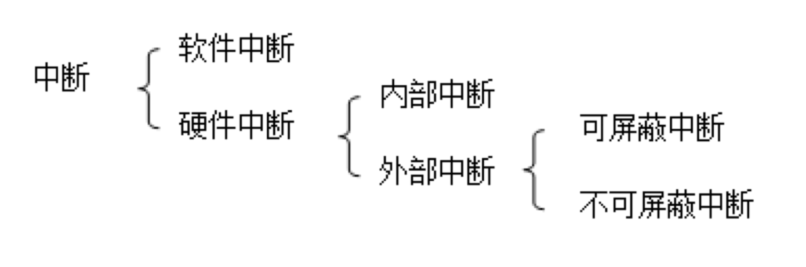

<h1>输入输出</h1>

[toc]

## 输入输出接口
- 输入输出系统的组成
  - 外围设备
    - 输入设备
    - 输出设备
  - 输入输出控制器（也叫IO控制器）
  - 整个系统的关系：主机 $\leftrightarrow$ IO控制器 $\leftrightarrow$ 外围设备
- IO控制器（接口）的基本概念
  - 由于外设的多样性，无法使得外设直接连到主机（CPU+存储器）。因此需要一个接口做过渡
- IO控制器（接口）的组成
  - 数据输入寄存器
    - 缓冲来自外部设备的输入数据
  - 数据输出寄存器
    - 缓冲主机的输出数据
  - 命令寄存器
    - 保存CPU发送给接口的控制命令，包括接口的功能、工作参数等
  - 状态寄存器
    - 保存外部设备的运行状态，供CPU查询使用
- IO控制器（接口）的编址方式
  - 统一的编址方式
  - 独立的编址方式
## 程序查询方式
- 操作步骤
  - 外设将数据传送到输入缓冲寄存器之后，将缓冲器满标志置1
  - 当CPU查询到缓冲器满标志位1时，就把数据读过来。
  - 读完数据之后，可以通过硬件或软件将缓冲器满标志置0
- 优点（**突出一个简单**）
  - 硬件电路简单
  - 程序结构简单
- 缺点
  - CPU利用率低（大量时间浪费在查询上）
  - 不能实现实时响应（等查询到才行）
## 中断控制方式
- 中断的类型

- 中断的用途
  - 并行操作
  - 实时处理
  - 故障处理
  - 分时操作
- 中断处理过程
  - CPU中断响应周期（**硬件完成**）
    - 发出中断响应信号（目的是获取中断类型码）
    - 把标志寄存器$FLAG$存入堆栈
    - 关中断
    - 保存断点
    - 根据中断类型码进入中断服务程序
  - CPU中断服务程序（**软件完成**）
    - 保护现场（把用到的寄存器存入堆栈，**只用存用到的**）
    - 执行中断处理
    - 恢复现场
    - 开中断
    - 中断返回
## DMA控制方式
- 中断的不足：额外开销太大，如果频繁中断会有很大浪费。
- DMA由纯硬件实现，不需要CPU干预，因此速度较快
### DMA操作模式
- 阵发模式（Burst Mode）
  - 一旦得到系统总线的访问权，就把一个完整的数据块以连续的顺序一次性传输。（**腹泻式传输**）
- 周期窃取模式（Cycle Stealing Mode）
  - 传一个字节，然后控制权返回给CPU，不断循环
- 透明模式（Transparent Mode）
  - CPU不用系统总线的时候，DMA就去用。这个过程由硬件完成，会使得系统复杂化
- CPU和DMA交替模式（Ping-pong Mode）
  - 没看明白

